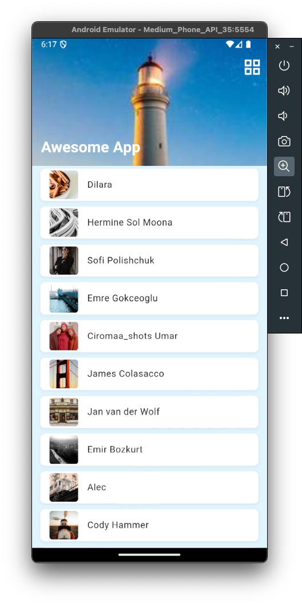
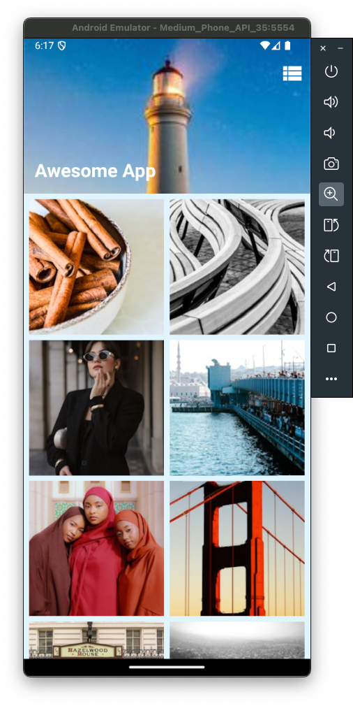
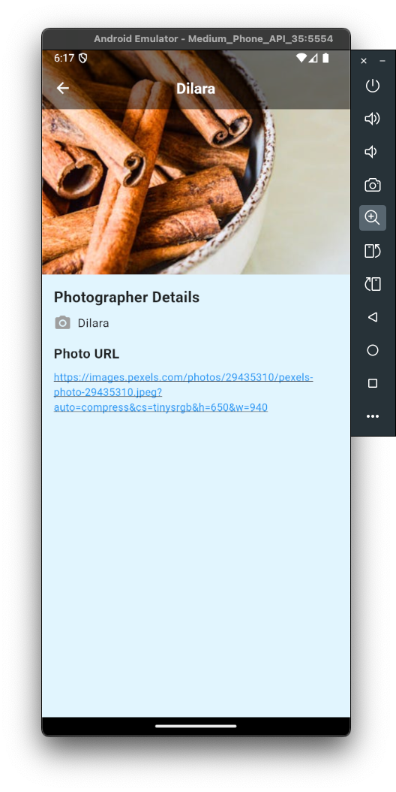

#  Awesome App

A visually appealing Flutter application to showcase a collection of photos fetched from an API. The app supports grid and list views, displays detailed photo information, and includes advanced features like multithreading for efficient image processing.

## Features
- Responsive UI:
    - Toggle between grid and list views for photo display.
    - Pull-to-refresh functionality to reload data.
- Offline Handling:
    - Displays cached photos when the user is offline.
- Shimmer Effect:
    - Beautiful skeleton loaders while data is being fetched.
- Detail Screen:
    - Shows photo details with clickable URLs that open in the browser.
    - Smooth transitions using hero animations.
- Multithreading:
    - Background image processing using Dart isolates for improved performance.
- Custom Theming:
    - Light blue background with a modern AppBar design.

## Screenshots

### Home Screen [List View]

### Home Mode [Grid VIew]

### Detail Screen 

## Tech Stack
- Flutter: Cross-platform UI toolkit.
- Dart: Programming language for Flutter.
- State Management: flutter_bloc for reactive state management.
- Shimmer: Skeleton loading animation.
- Cached Network Images: Efficient image caching and error handling.
- Multithreading: Dart isolates for background tasks.

## Requirements
- Flutter SDK: Version 3.0.0 or higher.
- Dart SDK: Version 2.17.0 or higher.
- Internet connection for fetching photos.
- Compatible with Android and iOS.

## Configuration
1. API Configuration
Ensure the pexels_service.dart file includes the correct API key for fetching photos.

2. Android Permissions
The following permissions are required and configured in the AndroidManifest.xml file:
```
<uses-permission android:name="android.permission.INTERNET" />
<uses-permission android:name="android.permission.ACCESS_NETWORK_STATE" />
```

## How It Works
### Photo Fetching
- API: Fetches photos from the Pexels API using pexels_service.dart.
- State Management: PhotoBloc manages loading, error, and success states.
### Multithreading
- Uses Dart isolates to process images in the background without blocking the main UI thread.
### Offline Handling
- Displays cached photos when offline using the connectivity_plus package.
